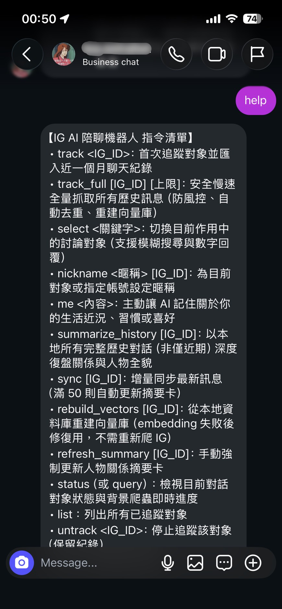
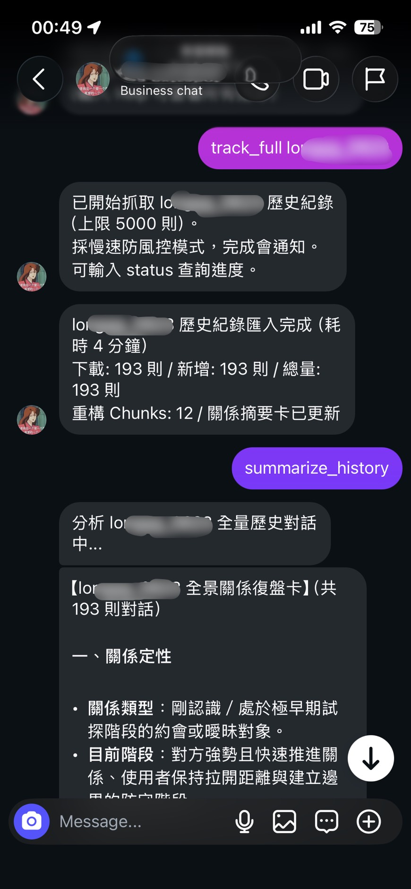

# 💬 BestieAI — Instagram 專屬 AI 社交與情感決策助理

[](https://www.python.org/)
[](https://github.com/astral-sh/uv)
[](./tests)

**bestieAI** 讓你直接在 **Instagram 私訊**裡與專屬 AI 助理對話。當朋友傳來令你困惑的訊息，AI 會調出你們的歷史對話脈絡，分析語氣意圖，給出兼顧情緒同理與實際策略的回覆建議——就像有個了解你所有關係的閨蜜 24 小時在線。

> 傳統做法：截圖 → 開 ChatGPT → 重新解釋關係背景 → 每次從零開始。
> **bestieAI**：直接在 IG 私訊說，AI 已經記得一切。

---

## 📱 實機畫面展示

<p align="center">
  
   
  
</p>
<p align="center">
  <em>左圖：在 IG 私訊中直接下達 <code>help</code> 指令查詢即時進度；右圖：全量抓取與自動生成深度全景關係復盤卡。</em>
</p>

---

## 💡 運作流程

```
[你的主帳號手機 IG App]
       │
       │ 1. 傳送：「track alex_123」
       ▼
[bestieAI 背景服務]
       ├─ 主帳號安全爬取與 alex_123 的歷史訊息
       ├─ 訊息清洗、時間切塊（Chunking）、生成 Gemini 向量 Embeddings
       └─ 自動生成初始「人物關係摘要卡」（儲存個性、相處模式與關鍵事件）
       │
       ▼
[Bot 帳號私訊回覆]：「已開始追蹤 alex_123，已匯入歷史對話並建立摘要卡！」

────────────────────────────────────────────────────────────

[日常聊天與策略討論]
       │
       │ 2. 傳送：「他剛剛回覆『隨便啊』，這到底什麼意思，我要怎麼回」
       ▼
[bestieAI 動態組裝 Prompt]
       ├─ 長期記憶：讀取 alex_123 關係摘要卡（性格慣性、溝通模式與關係底線）
       ├─ 自身記憶：從獨立 user_self 向量庫檢索使用者自身的習慣與近況
       ├─ 中期 RAG：以「隨便啊」語意搜尋歷史最相關的爭執或互動片段
       ├─ 短期記憶：撈取 IG 最近 30 則原始對話 ＋ 最近 10 輪 Bot 討論歷史
       └─ 跨對象調用：若訊息提到其他朋友暱稱（如「小伊」），同步調出該對象記憶
       │
       ▼
[Bot 帳號私訊回覆]：
       「欸不是，妳先冷靜。翻一下紀錄他加班後本來就常回這句，不是針對妳在冷淡。
        如果妳想接球但不想給壓力，直接回『好喔那我先去忙～晚點再說』就好，不要急著腦補追問。」
```

---

## 🛠️ 技術架構與工程亮點

### 1. Hierarchical Memory & RAG

LLM 的上下文視窗有限且成本高昂。本專案設計四層記憶模型，讓每次回覆只載入「剛好夠用」的資訊：

| 層次     | 技術                            | 內容                                               |
| :------- | :------------------------------ | :------------------------------------------------- |
| 短期記憶 | 直接載入                        | 最近 30 則 IG 原始訊息 ＋ 最近 10 輪 Bot 對話歷史  |
| 中期記憶 | ChromaDB + Gemini Embedding     | 依語意從歷史對話中檢索最相關片段（可回溯數個月前） |
| 長期記憶 | SQLite + LLM 生成摘要卡         | 對象性格、溝通慣性、關係轉折的結構化長文摘要       |
| 自身記憶 | 獨立`user_self` ChromaDB 集合 | 使用者自身近況與習慣，支援跨對話持久記憶           |

**跨對象記憶調用**：`nickname` 別名索引支援在聊天中提及朋友暱稱時，自動動態關聯查詢該對象的記憶向量庫。

### 2. 反爬蟲與風控安全工程

由於採用私有 API 模擬 App 登入，防風控為本專案核心挑戰之一：

- **白名單裝飾器（`@require_whitelist`）**：最外層嚴格攔截非本人私訊，陌生訊息一律靜默丟棄，杜絕資安漏洞。
- **Session 金鑰自動持久化**：Fernet 對稱加密並自動落地 `data/.session_key`，避免重啟引發頻繁重登風控。
- **單執行緒背景隊列 Worker**：爬取任務嚴格循序執行，任務交接處強制冷卻 60~120 秒，杜絕高併發封號風險。
- **擬真人長尾隨機延遲**：延遲範圍 3.5 - 14.0 秒（大標準差），15% 機率觸發 18 - 40 秒微停頓；每 4 - 7 頁隨機深度休眠 35 - 80 秒。
- **MQTT Realtime 被動監聽**：長連接被動接收推播，徹底擺脫主動輪詢帶來的風控負擔。

### 3. 架構設計與高容錯 LLM 陣列

- **多組 Gemini API Key 動態輪換（`GeminiKeyRing`）**：Round-Robin 平均負載；個別 Key 遭遇 429 限速時自動標記冷卻 65 秒並切換下一組，有效突破免費方案每分鐘配額上限。
- **多模型自動容錯降級陣列**：API 尖峰或 503 過載時，自動依序切換候選模型。
- **宣告式指令路由（`@command_handler`）**：Registry 模式取代龐大 `if/elif` 鏈，支援別名與模糊搜尋，高內聚低耦合。
- **批次級斷點續傳**：提煉時依時間區間比對本地快取，重跑時精準跳過已完成批次，節省 API 額度。
- **非同步執行緒化**：向量庫建立、歷史摘要等耗時任務全數以背景守護執行緒執行，不阻塞指令接收。
- **外部 Prompt 範本化**：所有 Prompt 抽離為 `app/prompts/*.txt`，無寫死字串，支援熱更新與版本控管。
- **結構化 Token 消耗日誌**：攔截 Gemini API `usage_metadata`，於 `llm.log` 詳細記錄每次呼叫的 Token 消耗。
- **高內聚單一職責分層（SRP）**：`app/clients/` 封裝外部服務、`app/pipelines/` 組裝業務 Prompt、`app/storage/` 純化本地存儲職責。

---

## 📋 指令一覽表

從**你的主帳號手機 IG 私訊**傳送給 Bot 帳號（括號內為極簡短別名）：

| 指令                          | 別名                   | 說明                                                                        |
| :---------------------------- | :--------------------- | :-------------------------------------------------------------------------- |
| `track <IG_ID>`             | `t`                  | 首次追蹤：爬取近一個月對話、向量化並生成初始人物關係摘要卡                  |
| `track_full [IG_ID] [上限]` | `tf`                 | 安全慢速抓取歷史訊息：預設最多 5000 則，含自動去重與重建向量庫              |
| `select <關鍵字>`           | `s`                  | 切換目前討論對象（支援模糊搜尋與數字回覆）                                  |
| `nickname <暱稱> [IG_ID]`   | `nn`                 | 為目前對象或指定帳號設定專屬暱稱                                            |
| `card [IG_ID/暱稱]`         | `c`                  | 檢視日常輕量人物關係摘要卡（300~500 字，不消耗 API、即時回傳）              |
| `card full [IG_ID/暱稱]`    | `cf`                 | 檢視 7 大章節全景關係深度復盤長文（若已生成過則直接回傳）                   |
| `me <內容>`                 | —                     | 主動讓 AI 記住關於你的生活近況、習慣或偏好（寫入`self_memory` RAG）       |
| `summarize_history [IG_ID]` | `sh`                 | **全景關係深度復盤**：以完整歷史對話建立 7 大章節長期全貌長文與日常卡 |
| `sync [IG_ID]`              | —                     | 增量同步最新訊息；累積達 50 則自動觸發摘要卡更新                            |
| `rebuild_vectors [IG_ID]`   | `rv`                 | 從本地 SQLite 重建向量庫（**不需重新爬 IG**，修復 Embedding 用）      |
| `refresh_summary [IG_ID]`   | `rs`                 | 強制以近期對話增量更新摘要卡                                                |
| `status`                    | `st`, `q`          | 顯示目前對象追蹤狀態；背景爬蟲執行中時同步顯示即時頁數與則數                |
| `list`                      | `ls`, `l`          | 列出所有已追蹤對象及其暱稱                                                  |
| `untrack <IG_ID>`           | —                     | 標記為停止追蹤（保留歷史資料）                                              |
| `help`                      | `h`, `?`, `指令` | 查詢核心指令說明；使用`help all` 查詢完整進階維護指令                     |
| `<一般訊息>`                | —                     | 進入 AI 陪聊模式；提及朋友暱稱時自動觸發跨對話記憶檢索                      |

> [!WARNING]
> **⚠️ API Token 額度注意**：`summarize_history`（或 `track_full` 完成後的全局摘要卡生成）會將所有歷史對話一次性送入 LLM 進行深度復盤，會產生**大量 Input Tokens**。請留意 Google Gemini API Key 的配額上限。系統預設採用 `gemini-2.5-flash-lite` 處理此任務（可在 `config.py` 或 `.env` 調整）。

---

## 🧪 測試涵蓋

```bash
uv run pytest -v tests
```

69 個單元測試，按模組分組：

**`tests/bot/`**

| 測試模組 | 涵蓋重點 |
| :--- | :--- |
| `test_poller.py` | 白名單攔截鑑權、背景非同步執行緒與狀態回報、Worker 邊界防護與任務交接冷卻 |
| `test_router.py` | 宣告式指令路由、模糊搜尋候選確認、`card` 查詢與聊天對話歷史傳遞 |
| `test_self_rag.py` | 使用者自身向量庫寫入/檢索、暱稱關聯、跨對話記憶調用與 `me` 指令 |

**`tests/pipelines/`**

| 測試模組 | 涵蓋重點 |
| :--- | :--- |
| `test_architecture_and_rag.py` | 時序向量分群演算法、多 Cluster 批次融合、時間感知滑動窗口切塊 |
| `test_breakpoint_resume.py` | 批次級時間區間斷點續傳命中與跳過機制 |
| `test_ingestion.py` | 歷史訊息清洗、時間分段 Chunking 與全景復盤卡生成 |
| `test_progress_reporting.py` | 提煉 / 融合 / 重建向量庫各階段 `progress_callback` 觸發與 `status` 即時進度回報 |

**`tests/storage/`**

| 測試模組 | 涵蓋重點 |
| :--- | :--- |
| `test_db.py` | 資料庫遷移、聯絡人 CRUD、訊息去重與摘要門檻判斷 |
| `test_concurrency.py` | 14 執行緒同時讀寫 SQLite 無死鎖、`GeminiKeyRing` 高併發 Race Condition 驗證 |

**`tests/unit/`**

| 測試模組 | 涵蓋重點 |
| :--- | :--- |
| `test_gemini_keyring.py` | 多組 API Key 輪換、429 標記冷卻 65 秒與備份金鑰容錯機制 |
| `test_llm_log.py` | `ENABLE_LLM_LOG` 開關、結構化 Token 用量（Prompt / Candidate / Total）日誌記錄 |
| `test_rate_limit.py` | 擬真人隨機延遲標準差檢驗與微停頓觸發率 |
| `test_sessions.py` | Fernet 金鑰本地持久化與 Session 加解密安全性 |

**`tests/contracts/`**

| 測試模組 | 涵蓋重點 |
| :--- | :--- |
| `test_api_contracts.py` | Instagrapi 與 Gemini SDK 合約模擬測試 |


---

## 🚀 快速開始

### 步驟 1：安裝 Python 3.11+ 與 `uv`

```bash
# macOS / Linux
curl -LsSf https://astral.sh/uv/install.sh | sh

# Windows (PowerShell)
powershell -ExecutionPolicy ByPass -c "irm https://astral.sh/uv/install.ps1 | iex"

# 或透過 pip
pip install uv
```

### 步驟 2：設定環境變數

```bash
cp .env.example .env
```

開啟 `.env`，**至少填入以下必填項目**：

| 必填欄位                  | 說明                                                               |
| :------------------------ | :----------------------------------------------------------------- |
| `MAIN_ACCOUNT_USERNAME` | 你的 IG 主帳號（負責安全讀取目標對象歷史對話）                     |
| `MAIN_ACCOUNT_PASSWORD` | 主帳號密碼                                                         |
| `BOT_ACCOUNT_USERNAME`  | AI 陪聊專用 Bot 帳號（負責接收指令並回傳建議）                     |
| `BOT_ACCOUNT_PASSWORD`  | Bot 帳號密碼                                                       |
| `GEMINI_API_KEY`        | 單組 Gemini Key，或改用`GEMINI_API_KEYS`（逗號分隔）啟用多組輪換 |

> 💡 `SESSION_ENCRYPTION_KEY` 留空時系統自動產生並持久化於 `data/.session_key`。其他 RAG 參數與爬蟲門檻均有完整預設值（見 `app/core/config.py`）。

### 步驟 3：安裝依賴並啟動

```bash
uv sync
uv run python main.py
```

> **首次啟動**：若 Instagram 觸發安全驗證或 2FA，終端機將出現互動式提示，請直接輸入驗證碼。驗證成功後，Session 以 Fernet 加密保存於 `data/sessions/`，後續重啟無需再次驗證。
